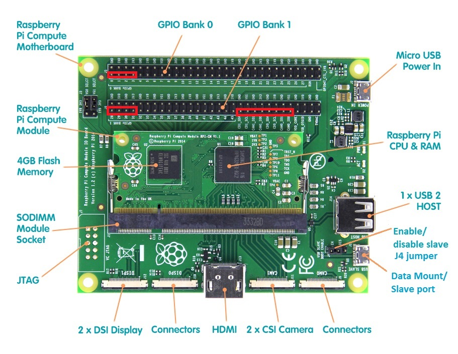

# Flashing the Compute Module eMMC

The Compute Module has an on-board eMMC device connected to the primary SD card interface. This guide has **simplified** and covers the following un-reader-friendly documents:
https://www.raspberrypi.org/documentation/hardware/computemodule/cm-emmc-flashing.md
https://www.raspberrypi.org/documentation/installation/installing-images/windows.md

## Download the os image

Official images for recommended operating systems are available to download from the Raspberry Pi website [Downloads page](https://downloads.raspberrypi.org/raspbian_lite_latest).

After downloading the `.zip` file, unzip it to get the image file (`.img`) for writing to your SD card.

## Install Windows driver 

1. Download and run the [CM-Boot-Installer.exe](https://www.raspberrypi.org/documentation/hardware/computemodule/CM-Boot-Installer.exe) to install the drivers and boot tool `RPiBoot.exe`.
1. Plug your host PC USB into the CMIO USB SLAVE port, making sure that J4 jummper (USB SLAVE BOOT ENABLE) is set to the 'EN' position.
1. Apply power to the CMIO board; Windows should now find the hardware and install the driver.
1. Once the driver installation is complete, run the `RPiBoot.exe` tool that was previously installed.
1. After a few seconds, the Compute Module eMMC will pop up under Windows as a disk (USB mass storage device).

## Install/restore os images using Windows

On Windows, all you have to do is download and install [Win32DiskImager](http://sourceforge.net/projects/win32diskimager/).
- Download Win32DiskImager, and start it (You may need to run this as administrator. (Right-click on it and select "Run as administrator" ).
- Select the image file
- Select the drive letter of the eMMC in the device box. Be careful to select the correct drive; if you get the wrong one you can destroy the data on your computer's hard disk! You can easily see the drive letter of the Compute Module eMMC, such as `G:`, by looking in the Windows Explorer/My computer. 

- Click `Write` and wait for the write to complete.
- Exit the Win32DiskImager and eject the eMMC.

## Backup operating system images using Windows
Similar to Install/restore operating system images using Windows, all you have to do is download and install [Win32DiskImager](http://sourceforge.net/projects/win32diskimager/).
- Load Win32DiskImager and click the Folder icon and browse to where you want to save your SD card image backup.

- Confirm the folder/filename are correct, and now you can click the READ button to start reading your SDcard into your (about-to-be-created) image file.
- Click `Read` and wait for the write to complete.
- Exit the Win32DiskImager and eject the Compute Module eMMC.

## Bonus: enabling ssh
As of the November 2016 release, Raspbian has the SSH server disabled by default. You will have to enable it manually. This can be done [during setup](raspbian-lite-setup.md) using `raspi-config`.

But, there is a shortcut:

***Before ejecting the Compute Module eMMC, create a file named 'ssh', without any extension, onto the eMMC.***

---

*This article uses content from the eLinux wiki page [RPi_Easy_SD_Card_Setup](http://elinux.org/RPi_Easy_SD_Card_Setup), which is shared under the [Creative Commons Attribution-ShareAlike 3.0 Unported license](http://creativecommons.org/licenses/by-sa/3.0/)*
