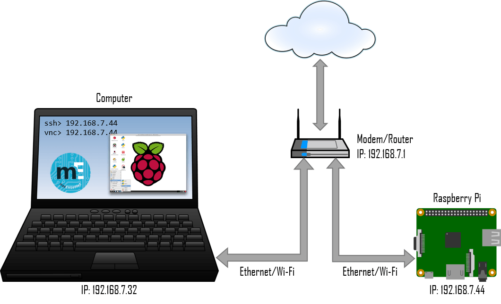
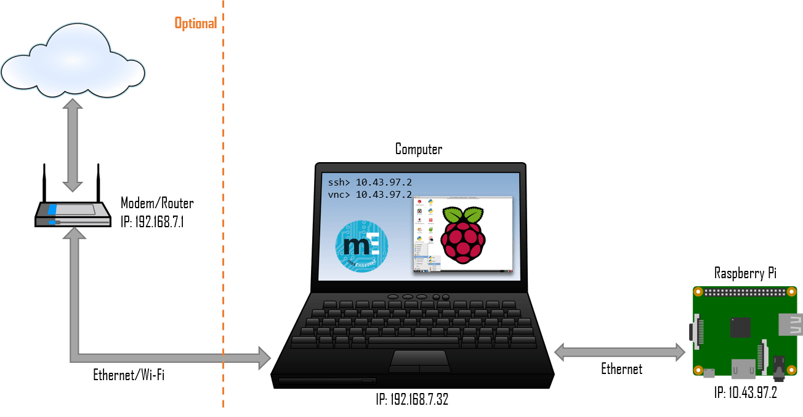

# Headless Setup

**Prerequisite: ssh must be enabled!**

## Step 1: Connecting RPi to the network
The idea behind this approach is that your RPi and your computer need to be connected to the same network. There are two ways to do this.

#### Method 1
Connect your RPi to the same network your computer is connected to. This means hooking up your RPi to your modem/router. Be aware that this will connect your RPi to the internet. This can achieved using either Ethernet or Wi-Fi.

#### Method 2 (recommended)
If you don’t have access to your router or if you can’t connect to your router due to encryption/security issues, then you might need to create your own LAN network between your computer and your RPi. Simply hook your RPi with your computer with an Ethernet cable. Unless you explicitly share your computer’s network with your RPi, there will be no internet connection available to your RPi.

## Step 2 – Determining IP Address
Once your RPi is connected to the network, it will have an IP address assigned to it. You can make the IP static (IP remains same every time you connect) or dynamic (IP changes every time you connect). If you are using static IP address for your RPi, then skip to the next step (step 3).
#### For Method 1:

Since you don’t know the IP address of your RPi (dynamic), you scan all the IP addresses in the range that your router/gateway corresponds to.

But you can always boot up the pi, login to you router and find the ip address (SO much easier):

#### For Method 2:
1. Go to Network and Sharing Center
2. Right Click your WiFi -> Properties -> Sharing
3. Select the "Allow other network users to connect through this computer’s Internet connection"
4. (If you have multiple adapters) Select Ethernet in Home and Networking Connections
5. open cmd and type: ping raspberrypi.mshome.net
7. It will give you the IP Address of the Raspberry Pi

## Step 3 – SSH into your Pi
After waiting a minutes or so for the Pi to boot up you can go into your router control panel and see who is connected to this router.
You should see raspberry-pi connected to the network on this list and it will display and IP address.
Take note of this IP address as we are now going to SSH into your Pi with IP.

Now on your Windows PC you need to download Putty which is an SSH client.
http://www.chiark.greenend.org.uk/~sgtatham/putty/download.html putty 32-bit is the file you need.

Enter in the IP address of the Pi that was shown on the router. 

After you have entered the IP address of your Raspberry Pi, click “Open” to initiate the connection. Ignore the warning.

If the SSH connection is successful you will now be greeted with the login prompt of your Raspberry Pi:

# Bonus: Set a static IP
***Many places online will tell you to put a desired ip address in the cmdline.txt. This will only work well if you are using Method 1. However, with Method 2, you will want to set the dhcpcd.conf instead.***
