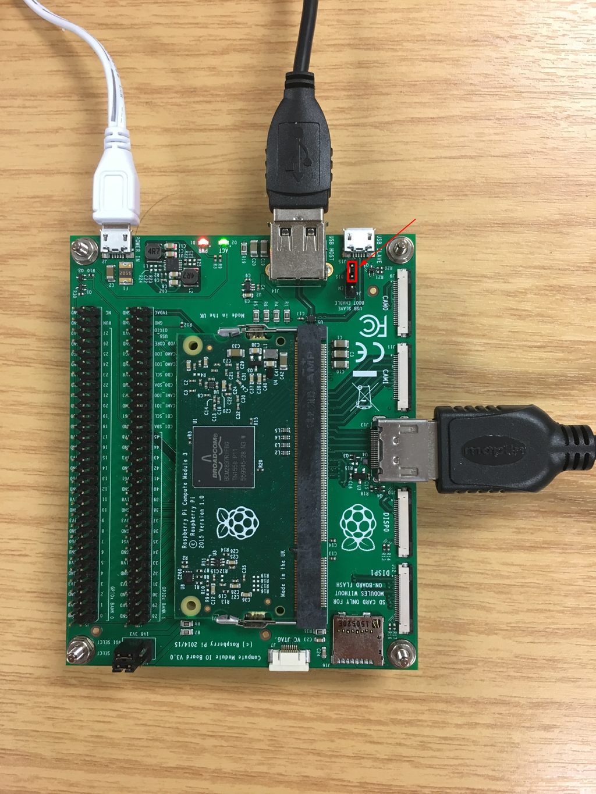

# Setup Raspbian lite
Assuming you have followed this:
[Flashing (install/restore) & backup the Compute Module eMMC storage](cm-emmc-flashing-install-backup.md)

**And have ejected the Compute Module eMMC, set J4 jummper to 'Dis' position.**

It's time to boot up and set the Raspberry Pi. There are two ways to do this.

## 1 - A basic setup
- HDMI cable + monitor
- Keyboard into the IO board
- power supply


**But you should use a USB Hub, so you can add Ethernet Adapter, WiFi Adapter and Mouse...and download updates and packages for the system.**

## 2 - Headless Setup (recommended)
You can do a [Headless Setup](headless-setup.md), where HDMI cable + monitor, Keyboard are no longer needed.

## Initial setup
The Raspberry Pi will boot immediately. This will take a little bit more than a minute. Once the Pi is booted it will ask you for the username and the password. By default the following log-in credentials can be used:

Username: pi

Password: raspberry

Now it is time to configure the Raspberry Pi. You can enter the Raspberry Pi configuration menu by typing the following from the command line:

```
sudo raspi-config
```

You should see a blue screen with options in a grey box in the centre, like so:


### 1 Expand File System
The first thing you should do is expand your filesystem to include all available space on the eMMC. Select the first option, “1. Expand File System”, hit Enter on your keyboard.


### 2 Internationalisation

Select `Internationalisation Options` and press `Enter` to be taken to a sub-menu containing the following options:

<a name="change-locale"></a>
#### Change locale

Select a locale, for example `en_US.UTF-8 UTF-8`.

<a name="change-timezone"></a>
#### Change timezone

Select your local timezone, starting with the region such as `America`, then selecting a city, for example `Vancouver`. Type a letter to skip down the list to that point in the alphabet.

<a name="change-keyboard-layout"></a>
#### Change keyboard layout

This option opens another menu which allows you to select your keyboard layout. It will take a long time to display while it reads all the keyboard types. Changes usually take effect immediately, but may require a reboot.

#### Set WiFi Country

Again at the Internationalisation submenu, select option I4 and pick your appropriate WiFi country.

<a name="advanced-options"></a>
### 3 Advanced options (optional)

If you haven't done it, you can enable SSH here.

<a name="ssh"></a>
#### SSH

Enable/disable remote command line access to your Pi using SSH.

SSH allows you to remotely access the command line of the Raspberry Pi from another computer. SSH is disabled by default. Read more about using SSH on the [SSH documentation page](../remote-access/ssh/README.md). If connecting your Pi directly to a public network, you should not enable SSH unless you have set up secure passwords for all users.

<a name="device-tree"></a>
#### Device Tree

Enable/Disable the use of Device Tree. Read more about Device Trees config on the [Device Trees documentation page](https://www.raspberrypi.org/documentation/configuration/device-tree.md).

<a name="spi"></a>

### 4 Finish

Arrow down to the `Finish` button, and hit Enter on your keyboard. It should reboot automatically, if it doesn't, then use the following command in the terminal to reboot.

```
sudo shutdown -r

```
## More setup
Once you rebooted, update and install these (hit 'Y' or ‘q’ when necessary) and you are good to go:
```
sudo apt-get update
sudo apt-get upgrade
sudo apt-get install raspi-gpio
```

## Bounus: clear downloaded archives
Once in a while, use `df -h` to check your free disk space. You can clear downloaded archives/temporary files (.deb files) that are kept in /var/cache/apt/archives with `sudo apt-get clean`.

---

*This article uses content from the eLinux wiki page [RPi raspi-config](http://elinux.org/RPi_raspi-config), which is shared under the [Creative Commons Attribution-ShareAlike 3.0 Unported license](http://creativecommons.org/licenses/by-sa/3.0/)*

